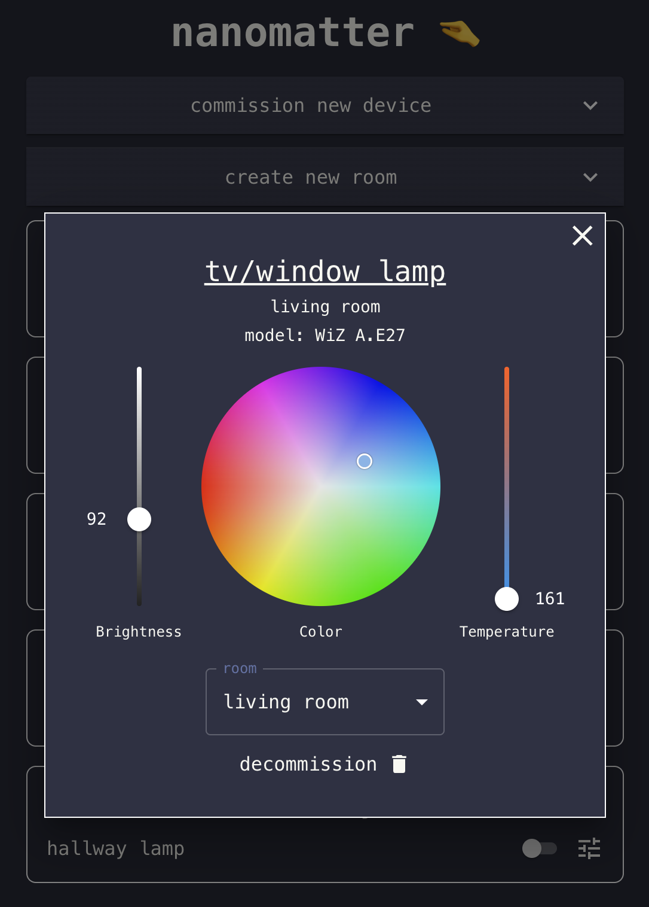

# nanomatter 🤏
Lightweight Matter controller used for comissioning and controlling devices.

Read about it here: [Nanomatter - Building a lightweight Matter controller](https://gabrielaleks.com/blog/building-a-lightweight-matter-controller/) and [Nanomatter - Building the frontend
](https://gabrielaleks.com/blog/nanomatter-building-the-frontend/)

## backend
### `devices` endpoints

```
GET    /api/devices                     → get all commissioned devices + state
GET    /api/devices/:id                 → get single device state
POST   /api/devices/commission          → start commissioning (returns jobId)
GET    /api/devices/commission/:jobId   → poll commissioning status
POST   /api/devices/:id/on              → turn on
POST   /api/devices/:id/off             → turn off
POST   /api/devices/:id/toggle          → toggle
POST   /api/devices/:id/brightness      → set brightness (0–254)
POST   /api/devices/:id/color           → set color (CT or hue/saturation)
PATCH  /api/devices/:id                 → update device
DELETE /api/devices/:id                 → decommission device
```

### `rooms` endpoints

```
GET    /api/rooms                             → get all rooms + devices
POST   /api/rooms                             → create room
PATCH  /api/rooms/:roomId                     → update room
DELETE /api/rooms/:roomId                     → delete room
POST   /api/rooms/:roomId/devices/:deviceId   → add device to room
DELETE /api/rooms/:roomId/devices/:deviceId   → delete device from room
```

## frontend
- Room dashboard: create, rename, and delete rooms; move devices between rooms
- Per-device controls: on/off toggle, brightness, color temperature, hue/saturation wheel
- Commission new devices via manual pairing code; polls job status until complete
- Decommission devices with a confirmation step

